### 作者微信：grapro666 QQ：3642795578 (支持部署调试、支持代做毕设和论文)

### 接javaweb、python、小程序、H5、APP、各种管理系统、单片机、嵌入式等开发

### 选题+开题报告+任务书+程序定制+安装调试+论文+答辩ppt

**博客地址：
[https://blog.csdn.net/2303_76227485/article/details/128661927](https://blog.csdn.net/2303_76227485/article/details/128661927)**

**视频演示：
[https://space.bilibili.com/384537280](https://space.bilibili.com/384537280)**

**毕业设计所有选题地址：
[https://github.com/ynwynw/allProject](https://github.com/ynwynw/allProject)**

## 基于Java+SpringBoot的个人博客管理系统032

## 一、系统介绍

前台：
- 文章列表、文章详情。       
- 评论。      
- 分类查看。      

后台管理：
- 文章统计、评论统计、附件统计、日志查看
- 文章发布
- 评论管理
- 文章管理
- 分类标签管理
- 文件管理

## 二、所用技术

### 后端
* 核心框架：SpringBoot
* 持久层框架：MyBatis
* 模板框架：Thymeleaf
* 分页插件：PageHelper
* 缓存框架：Ehcache
* Markdown：Commonmark

### 前端
* JS框架：Jquery
* CSS框架：Bootstrap
* 富文本编辑器：editor.md
* 文件上传：dropzone
* 弹框插件：sweetalert

### 第三方
* 七牛云（文件上传）/本地文件上传
* 百度统计    

## 三、环境介绍

基础环境 :IDEA/eclipse, maven3.x, JDK 1.8 , Mysql, 

源码+数据库脚本 

所有项目以及源代码本人均调试运行无问题 可支持远程调试运行

## 四、页面截图

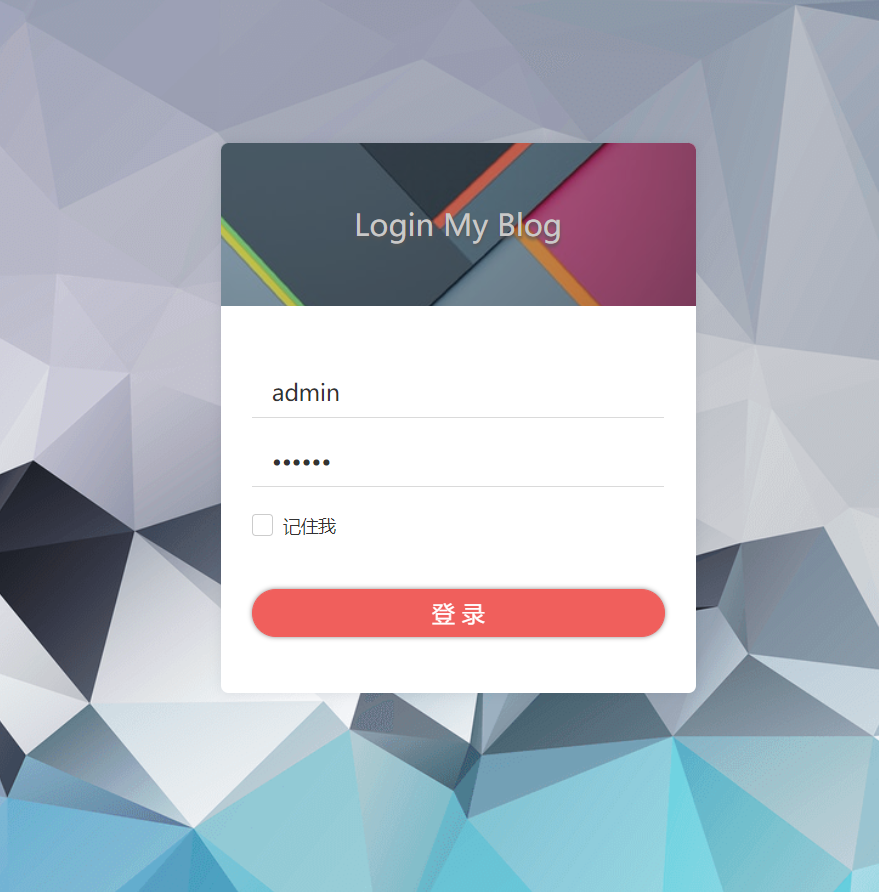

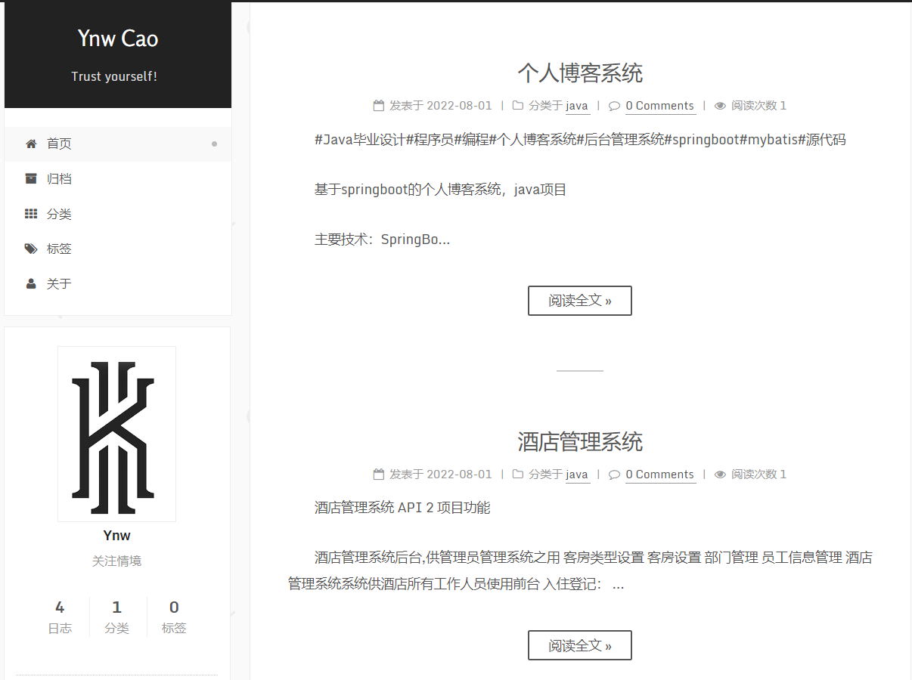

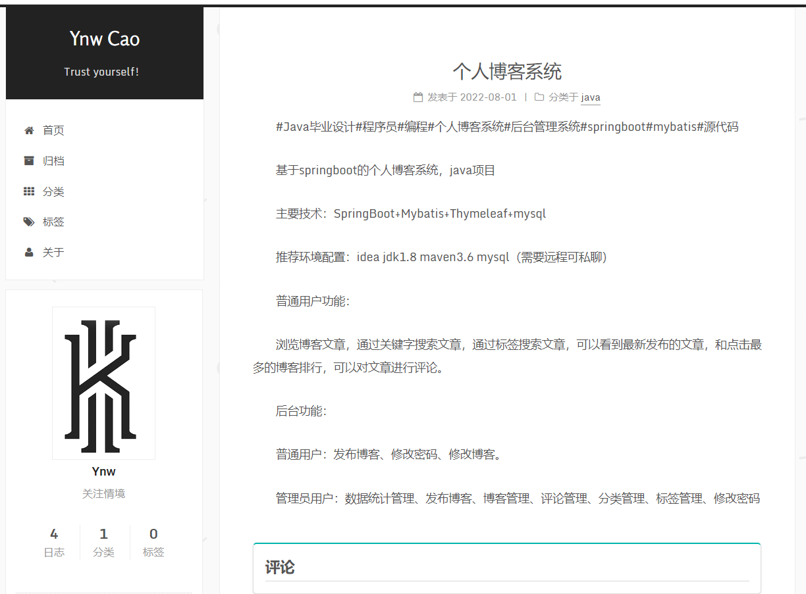

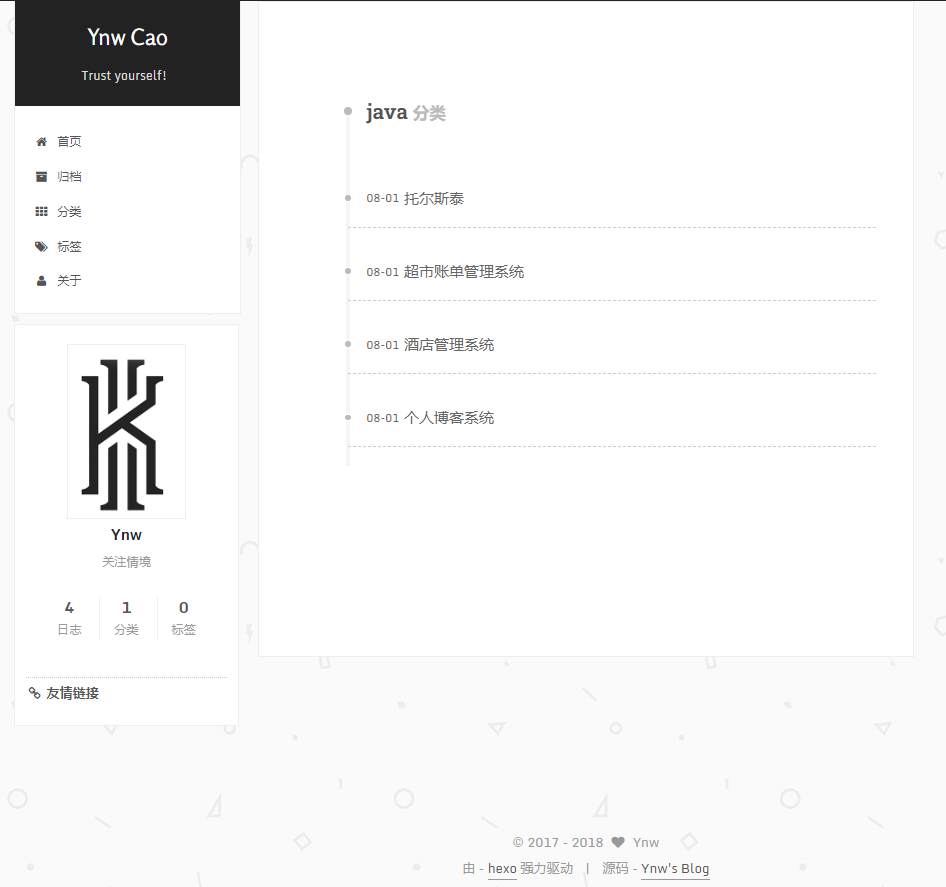

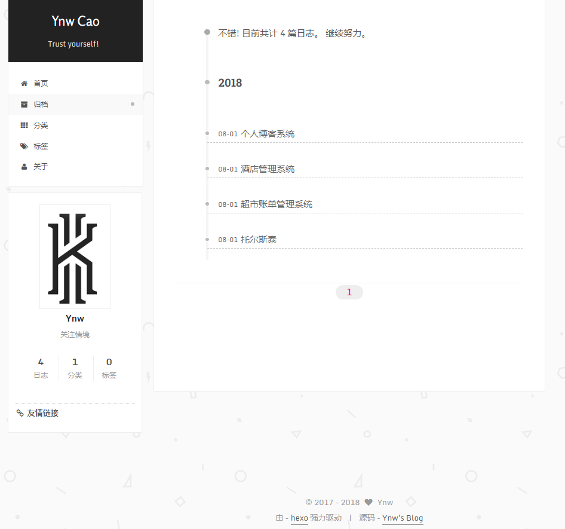

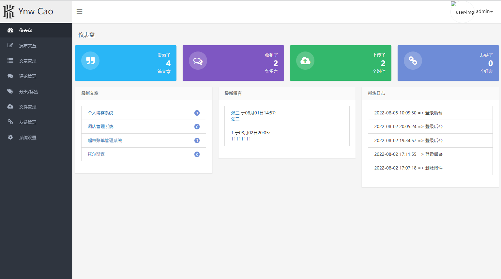

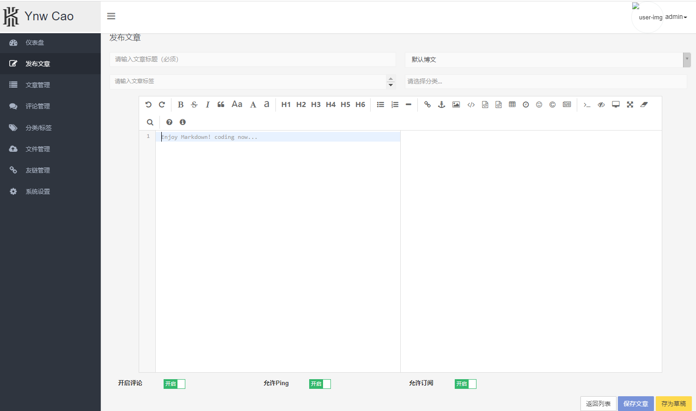

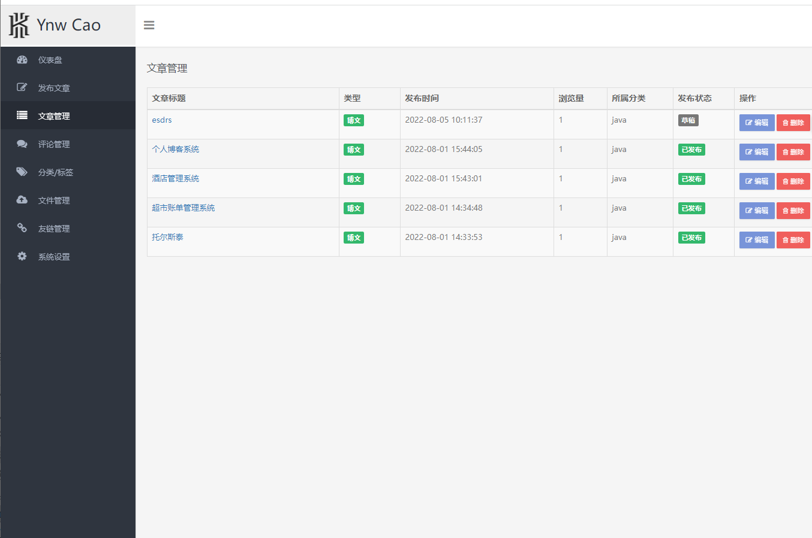

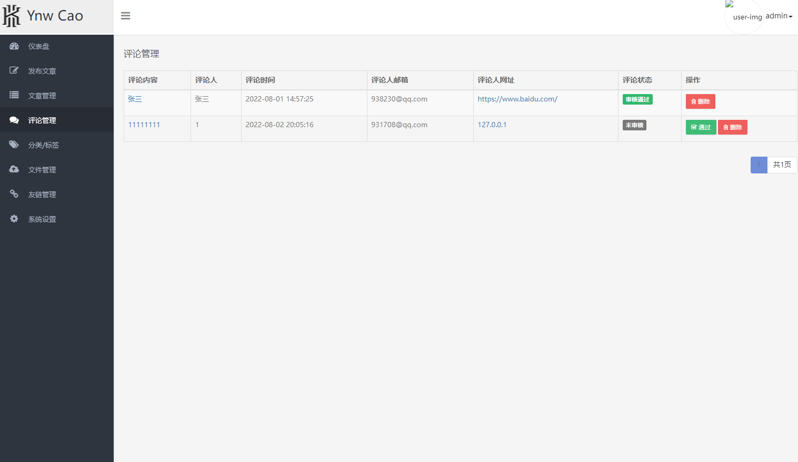

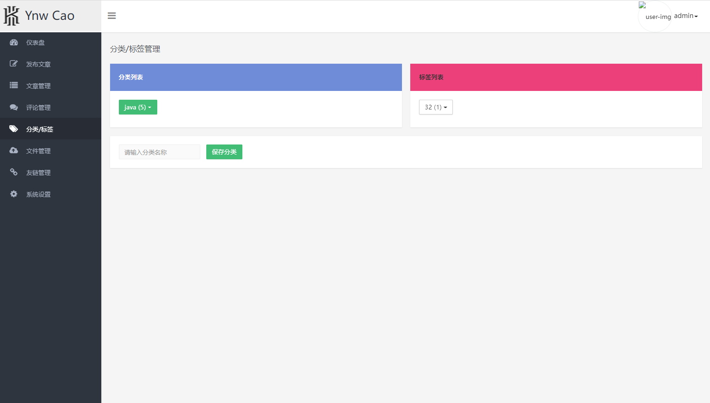

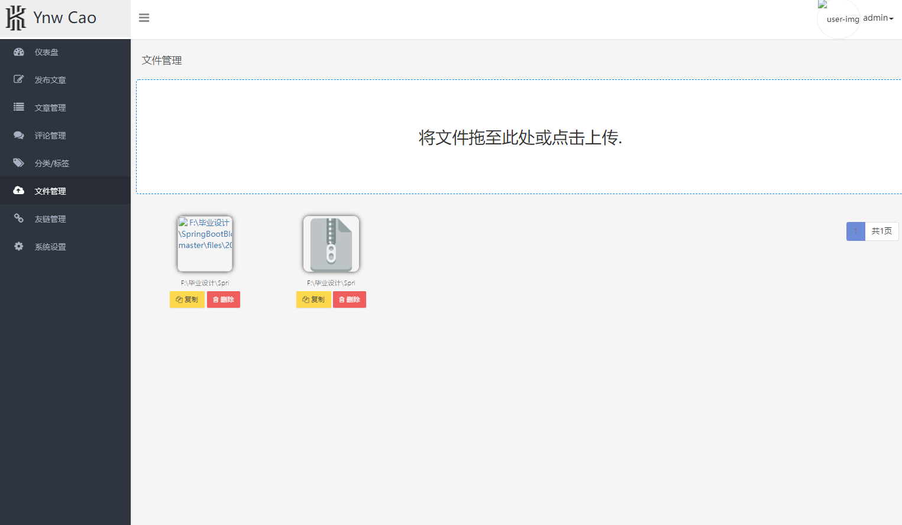

## 五、浏览地址

前端访问地址：http://localhost:8122

后台访问地址：http://localhost:8122/admin 用户名：admin 密码：123456

## 六、安装教程

下载源码，执行sql文件，然后修改application-dev.yml文件中连接数据库的用户名、密码。运行项目即可。

